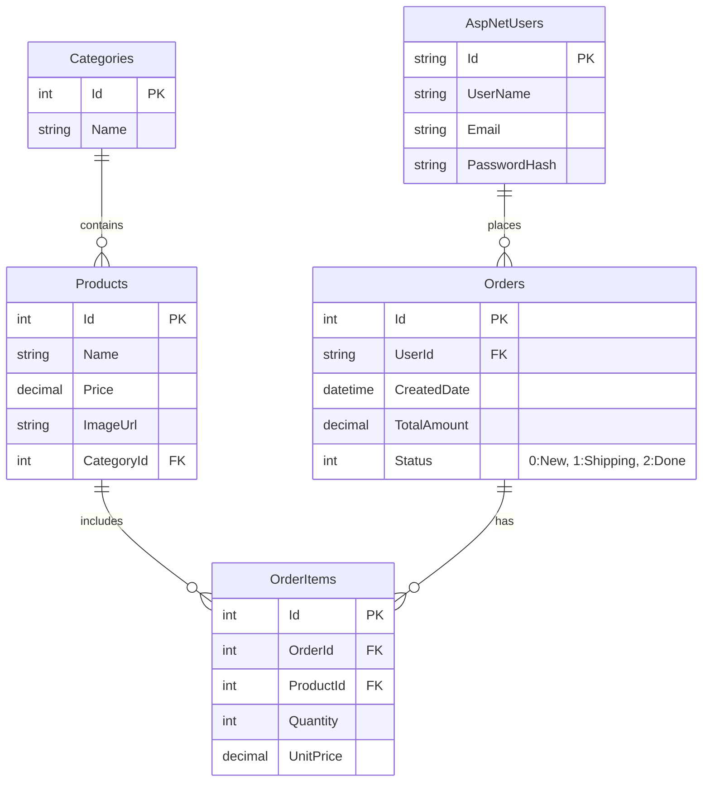

# 🗄️ CƠ SỞ DỮ LIỆU DNU SHOP

## 1. Sơ đồ ERD (Entity Relationship Diagram)

## 2. Giải thích bảng

### Products (Sản phẩm)
- `ImageUrl`: Lưu đường dẫn tương đối (VD: `/images/iphone.jpg`).
- `Price`: Kiểu `decimal(18,2)` để tránh sai số tiền tệ.

### Orders (Đơn hàng)
- `Status`: Dùng Enum trong C# để quản lý trạng thái.
- `TotalAmount`: Tổng tiền đơn hàng (đã trừ khuyến mãi nếu có).

### OrderItems (Chi tiết đơn hàng)
- `UnitPrice`: Lưu giá tại thời điểm mua (đề phòng giá sản phẩm thay đổi sau này).
